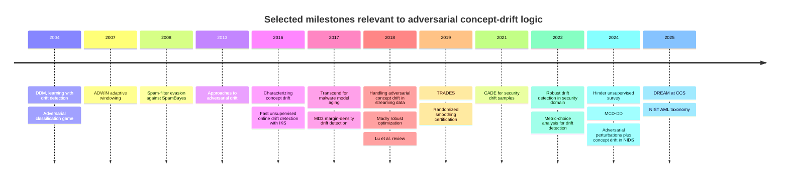
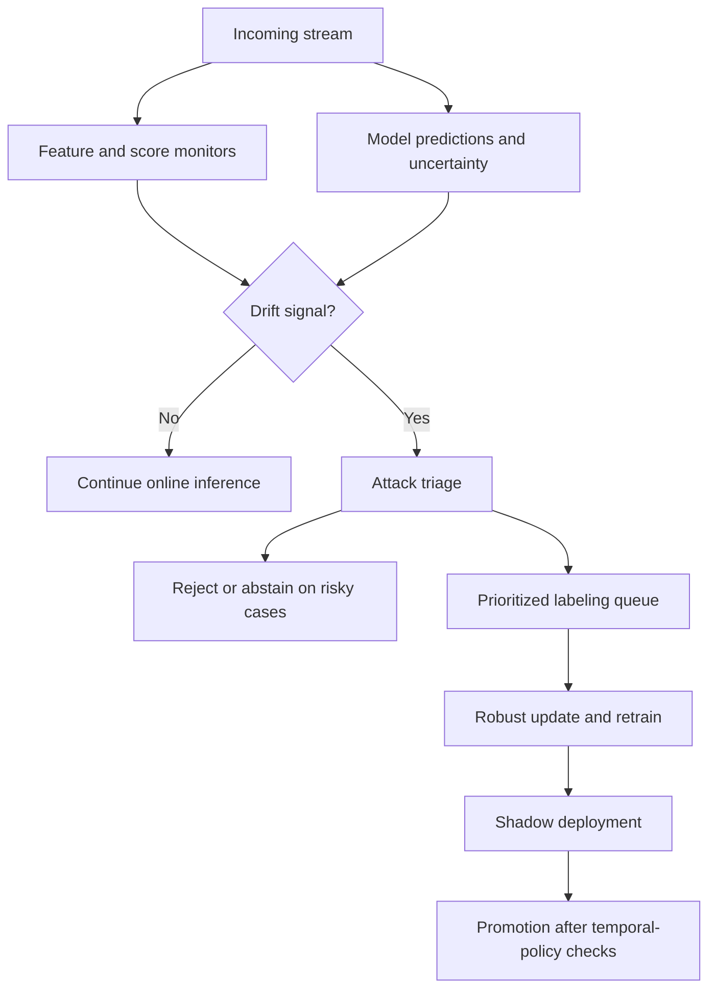
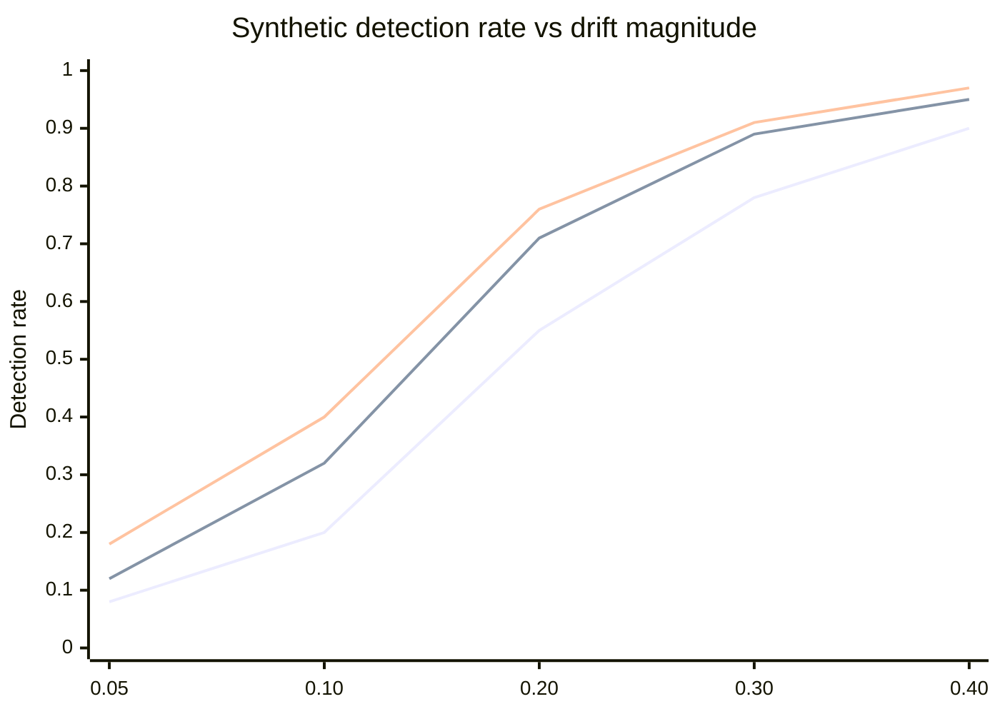

# Adversarial Concept-Drift Logic

## Executive summary

Concept drift refers to time variation in the data-generating process. In the standard stream-learning formulation, drift exists when the joint distribution changes between times \(t_0\) and \(t_1\), and the most important split for prediction work is between real drift, where \(p_t(y \mid X)\) changes, and virtual drift, where \(p_t(X)\) changes without changing \(p_t(y \mid X)\). The literature also shows that drift type, drift magnitude, and label availability strongly shape detector quality. Webb et al. gave one of the first rigorous quantitative taxonomies, while major reviews by Gama et al., Lu et al., Hinder et al., Bayram et al., and Hovakimyan et al. organized the field into detection, adaptation, and monitoring families. citeturn32view3turn32view0turn27search16turn16search5turn30view1turn28view10turn11search23

Adversarial concept drift is a stricter case. Here, a strategic opponent actively shapes the stream, the feedback loop, or both, with goals such as present-time evasion, future model degradation, detector fatigue, or poisoning-assisted blind spots. Security papers frame this explicitly as adversarial drift or attacker-induced drift, and Korycki and Krawczyk show that standard drift detectors do not reliably separate natural drift from adversarial drift. NIST’s 2025 AML taxonomy places these mechanisms inside a broader attack hierarchy spanning evasion, poisoning, attacker knowledge, attacker goals, and lifecycle stage. citeturn29view0turn28view2turn38view5turn39view1turn41view0

There is no widely adopted formalism published under the exact label *Adversarial Concept-Drift Logic* in the sources reviewed here. The field instead splits across three strands: concept-drift mathematics, adversarial machine learning, and runtime monitoring. This report therefore proposes an analytical synthesis with three linked layers: a probabilistic layer for evolving distributions, a dynamic game layer for attacker-defender interaction, and a temporal logic layer for policies, alerts, and retraining obligations over time. That synthesis aligns with the mathematical direction in Webb et al. and Hinder et al., the strategic direction in Dalvi et al., L’Huillier et al., Madry et al., and recent AML taxonomies, and the monitoring direction in runtime-verification work on LTL and STL. citeturn32view0turn30view1turn5search1turn5search12turn28view5turn41view0turn19search1turn19search11

The strongest operational lesson is practical. No single detector dominates across all drift types, and false alarms accumulate under repeated production monitoring. The best current practice uses layered monitoring, reject or abstain regions, targeted relabeling, online ensemble adaptation, robust training for local perturbations, domain-specific explanation, and explicit human review for high-risk alerts. Reviews and recent empirical work support this multi-layer design, especially in security and healthcare. citeturn25search14turn15search2turn38view3turn39view1turn26search0turn26search6turn35view1turn35view2

## Foundations and formalization

The base mathematical object is a time-indexed stream \(\{(X_t,Y_t)\}_{t \ge 1}\). Gama et al. define concept drift between \(t_0\) and \(t_1\) by the existence of input values for which the joint distribution differs, \( \exists X: p_{t_0}(X,y) \neq p_{t_1}(X,y)\). They also separate real drift, \(p_t(y\mid X)\) changes, from virtual drift, \(p_t(X)\) changes while \(p_t(y\mid X)\) stays fixed. Webb et al. then push this into a more rigorous quantitative framework, which is useful because many practical failures depend not only on whether drift exists, but on its rate, recurrence, magnitude, and locus in feature space or decision space. citeturn32view3turn33view0turn32view0turn32view2

I propose the following working definition for adversarial concept drift:

\[
\tilde P_t = \Gamma_t(P_t, a_t, b_t),
\]

where \(P_t\) is the environment distribution at time \(t\), \(a_t\) is an attacker action, \(b_t\) is a defender action, and \(\Gamma_t\) maps the natural stream into the observed stream. Drift is adversarial when at least part of \(\Gamma_t\) is chosen strategically to raise defender risk or retraining cost subject to attacker constraints. This definition absorbs test-time evasion, train-time poisoning, feedback manipulation, delayed-label abuse, and hybrid attacks that shape future adaptation. It matches the intuition in adversarial-drift papers that the stream is not merely non-stationary, but strategically non-stationary. citeturn29view0turn28view2turn38view5turn41view0

A rigorous framework benefits from three linked views.

| Framework | Core objects | What it models well | Main blind spot |
|---|---|---|---|
| **Probabilistic ACDL** | \(P_t(X,Y)\), latent mode \(Z_t\), attacker action \(a_t\), defender policy \(b_t\) | Natural drift, class-prior drift, conditional drift, poisoning as distribution transport, detector statistics such as KS, MMD, error rate, uncertainty, or conformal nonconformity. This view fits the formal drift definitions in Gama et al., Webb et al., and modern unsupervised monitoring work. citeturn32view3turn32view0turn30view1turn24search0turn38view2 | Strategic incentives stay implicit. |
| **Game-theoretic ACDL** | Repeated game \((a_t,b_t)\), utilities \(U_A,U_D\), knowledge sets, action costs | Strategic evasion, poisoning, surrogate-model attacks, retraining pressure, query abuse, label-delay exploitation. This view follows adversarial classification, phishing signaling games, robust optimization, and modern AML taxonomy work. citeturn5search1turn5search12turn28view5turn28view6turn41view0 | Pure probability tests miss utility and equilibrium structure. |
| **Temporal-logic ACDL** | Trace predicates over time, such as `drift`, `attack_signal`, `abstain_rate`, `retrain_done` | Safety and policy rules for operations, such as alert deadlines, human-review obligations, or retraining service-level rules. This view follows LTL and STL runtime monitoring literature. citeturn19search1turn19search11turn19search9 | Needs good predicate design and robust thresholding. |

A compact game-theoretic formulation is:

\[
\min_{b_{1:T}} \max_{a_{1:T}} \sum_{t=1}^T \Big[ \ell(f_t^{b_t}(T_{a_t}(x_t)), y_t) + \lambda \, C_{\text{ops}}(b_t) - \mu \, C_A(a_t) \Big].
\]

Here, \(T_{a_t}\) is an attacker transformation, \(\ell\) is task loss, \(C_{\text{ops}}\) is defender monitoring or retraining cost, and \(C_A\) is attacker cost. This structure fits robust optimization for local perturbations, but it also extends to a stream where the attacker spreads effort across time rather than across a single input. Madry et al. study the saddle-point view for adversarial robustness, while earlier adversarial-classification papers study equilibrium behavior directly. citeturn28view5turn5search1turn5search5

A temporal-logic layer turns those ideas into operational rules. Let \(D_t\) denote a drift score, \(A_t\) an attack score, \(R_t\) a retraining event, and \(H_t\) a human-review event. Then rules such as

\[
\mathbf{G}(D_t>\tau_D \land A_t>\tau_A \rightarrow \mathbf{F}_{\le h} H_t)
\]

and

\[
\mathbf{G}(D_t>\tau_D \rightarrow \mathbf{F}_{\le k} R_t)
\]

state that every high-confidence adversarial-drift alert must reach an analyst within \(h\) steps, and every confirmed drift must trigger retraining within \(k\) steps. This is not a standard published ACDL syntax. It is a direct adaptation of LTL or STL monitoring ideas to drift governance. Runtime-verification work already supports robust online monitoring of temporal properties, which makes this extension technically natural. citeturn19search1turn19search11turn19search9

## Literature landscape and attack taxonomy

The literature has a clear progression. Early work focused on defining drift and maintaining predictive accuracy under changing streams. The next wave added online error monitoring and adaptive windows. Security work then argued that standard drift notions were insufficient once an adversary began shaping the stream. More recent work moved toward unlabeled monitoring, high-dimensional representation learning, feature-shift localization, explanation, and security-specific adaptation pipelines. Recent reviews also show that image streams, healthcare, and fully unlabeled settings remain less mature than tabular supervised streams. citeturn35view0turn36view0turn29view0turn27search0turn30view1turn38view2turn11search23turn16search5



Several papers deserve special attention because they structure the field. DDM formalized drift alerts from rising online error. ADWIN added adaptive windows with false-positive and false-negative guarantees. Webb et al. formalized drift types quantitatively. Sethi and Kantardzic connected drift detection with adversarial streams through the Predict-Detect architecture. Korycki and Krawczyk added explicit adversarial-drift taxonomy under poisoning. MCD-DD pushed recent unlabeled high-dimensional detection through concept embeddings, and NeurIPS 2023 work on adversarial feature-shift detection linked discriminators, localization, and monitoring more tightly. citeturn37view0turn37view2turn36view0turn32view0turn27search0turn38view5turn30view0turn40view0

A useful attack taxonomy for ACDL needs more than the standard AML split between evasion and poisoning. It also needs an explicit time axis.

| Axis | Categories | Operational reading |
|---|---|---|
| **Lifecycle stage** | Test-time evasion, train-time poisoning, feedback manipulation, hybrid multi-stage attack | NIST’s AML taxonomy already separates attacks by stage, goals, knowledge, and capability. For drift logic, the key extension is longitudinal interaction with retraining and label pipelines. citeturn41view0 |
| **Temporal profile** | Abrupt, gradual, recurring, cyclical, stealth low-rate | Drift reviews show that detector behavior changes sharply across rate and recurrence pattern, which is one reason no universal detector exists. citeturn32view0turn28view10turn25search14 |
| **Observed space** | Feature drift, prior drift, conditional drift, representation drift, decision-boundary drift | Gama et al., Moreno-Torres et al., and later monitoring work distinguish these shifts because each one calls for a different detector and a different fix. citeturn32view3turn18search0turn30view1 |
| **Attacker objective** | Immediate evasion, future model decay, alarm fatigue, label-budget exhaustion, false retraining trigger | Adversarial-drift work in security and detector-fatigue studies show that long-horizon goals matter as much as present-time evasion. citeturn29view0turn38view5turn15search2 |
| **Knowledge model** | Black-box, gray-box, white-box | Fraud and classic AML work both show that partial knowledge often suffices for strong attack success. citeturn41view1turn5search1 |

This taxonomy leads to a strong analytical point: adversarial concept drift is not a single problem. It is the intersection of non-stationarity, sequential decision-making, detector calibration, and security economics. A drift score alone is not enough. The system also needs source attribution, cost-aware response, and protections against detector manipulation. citeturn38view5turn41view0turn15search2

## Case studies and public datasets

The clearest real-world evidence comes from security domains. Spam filtering has long served as a textbook example because the stream changes in response to the filter itself. Bills, wording, obfuscation, and sender behavior shift over time, and spammers react against deployed classifiers. Early work on spam drift highlighted this attacker-driven change directly, TREC’s spam benchmark preserved chronological order to reflect operational filtering, and Berkeley’s SpamBayes study showed that adversarial email modifications reduced filter effectiveness in practice. citeturn27search6turn23search3turn5search0turn5search8

Fraud detection shows a different pattern. Customer behavior drifts naturally, while fraudsters probe and adapt strategically. Dal Pozzolo et al. emphasized delayed labels and changing transaction habits as central operational constraints. Carminati et al. then showed that banking fraud detectors faced evasion rates between 60% and 100% on two real bank datasets, and FRAUD-RLA later extended this line with a reinforcement-learning attack model tailored to fraud settings. citeturn7search6turn41view1turn8search1

Malware detection offers perhaps the most developed adversarial concept-drift literature. Transcend targeted model aging before major performance loss. CADE formalized two useful classes of drift in multi-class malware tasks, Type A, a new class entering the stream, and Type B, in-class evolution. Later work found that data-space drift contributed more to degradation than feature-space drift in several malware settings, and DREAM pushed further by combining explanatory drift detection with adaptation for Android malware at CCS 2025. citeturn28view4turn29view1turn26search7turn26search6turn16search0

Autonomous-driving systems sit at the boundary between natural and adversarial drift. Weather, illumination, fog, traffic density, and sensor degradation shift the input distribution over time, while physical adversarial objects target the perception stack directly. The SHIFT dataset was designed exactly for continuous driving-domain shifts in weather, time of day, and traffic density, and Eykholt et al. showed that physical stop-sign perturbations caused detector failure in over 85% of controlled lab video frames and in large fractions of outdoor frames as well. In practice, an AV team needs to treat these as a coupled problem rather than as separate robustness topics. citeturn22search3turn10search19turn41view2turn10search0

Medical diagnosis and clinical AI show equally serious stakes. Healthcare reviews describe concept drift from changing practice patterns, patient populations, disease prevalence, and data acquisition. Sahiner et al. discuss data drift and concept drift in medical ML, Kore et al. show that monitoring model performance alone is a poor proxy for data drift in real medical imaging, and drift sensitivity depends strongly on sample size and patient features. At the same time, medical-image classifiers remain vulnerable to adversarial attacks, which means hospitals face both natural and intentional distribution shift. citeturn11search0turn11search3turn38view3turn11search1turn11search8

The table below condenses the domain evidence.

| Domain | Drift mechanics | Concrete documented example | Representative source |
|---|---|---|---|
| Spam | Adversarial wording change, obfuscation, sender-behavior shift | TREC Spam Track delivered chronologically ordered email streams; Berkeley work showed practical spam-filter evasion against SpamBayes. citeturn23search3turn5search0 | Case-based spam drift tracking, TREC, SpamBayes attack work. citeturn27search6turn23search3turn5search8 |
| Fraud | Natural customer-habit drift plus strategic transaction mimicry | Real bank studies reported fraud-detector evasion rates from 60% to 100% under AML attacks. citeturn41view1 | Dal Pozzolo et al., Carminati et al., FRAUD-RLA. citeturn7search6turn41view1turn8search1 |
| Malware | New families, behavioral mutation, packed or evolved families | Transcend flagged aging malware classifiers early; CADE formalized Type A new-class drift and Type B in-class evolution. citeturn28view4turn29view1 | Transcend, CADE, DREAM, recent drift analyses. citeturn26search1turn26search0turn26search6turn26search7 |
| Autonomous vehicles | Weather, time, illumination, density shifts plus physical perturbations | SHIFT models continuous domain shifts; physical stop-sign attacks fooled YOLO in over 85% of lab video frames. citeturn22search3turn41view2 | SHIFT, adverse-weather survey, physical-object attacks. citeturn22search3turn10search0turn41view2 |
| Medical diagnosis | Population shift, practice change, disease prevalence, imaging protocol shift | COVID-19 induced detectable drift in chest X-rays; performance monitoring alone was a poor drift proxy. citeturn38view3 | Healthcare drift survey, medical-imaging drift experiments, adversarial imaging studies. citeturn11search0turn38view3turn11search1 |

For experiments, the strongest public dataset choices are the following.

| Dataset | Why it is useful for adversarial drift studies | Notes |
|---|---|---|
| **TREC 2007 Spam Track** citeturn23search3 | Chronological email filtering setup, user-feedback variants, classic adversarial text domain | Strong fit for drift plus feedback-delay experiments. |
| **CIC-IDS2017** citeturn22search0 | Intrusion streams with modern attack categories | Good for unlabeled or weakly labeled security monitoring. |
| **EMBER** citeturn41view3 | 1.1 million PE files with open features and baseline models | Strong Windows malware benchmark for time-based splitting. |
| **AndroZoo** citeturn22search2turn22search10 | Massive Android app corpus with malware labels and metadata | Strong source for longitudinal Android malware drift work. |
| **SHIFT** citeturn22search3turn10search19 | Continuous autonomous-driving shifts in weather, time, and scene density | Good for perception drift and stress testing under structured domain change. |

## Detection and mitigation strategies

The detector family tree splits into five main lines. First, supervised error-rate monitors such as DDM and EDDM trigger on rising error or longer error distances. Second, window-comparison methods such as ADWIN and KS-based detectors compare old and new statistics. Third, unlabeled representation methods use embeddings, uncertainty, contrastive learning, or discriminators. Fourth, adaptive learners such as ensembles and forests respond through online weighting, background learners, or expert replacement. Fifth, AML defenses such as adversarial training and certification harden local robustness, which helps for some test-time perturbations but does not remove the need for stream monitoring. citeturn37view0turn36view0turn35view3turn38view0turn30view0turn35view1turn35view2turn28view5turn28view6turn28view7

A central practical distinction is label dependence. DDM-style methods need labels or a reliable proxy such as delayed confirmed outcomes. ADWIN is more flexible because it monitors any scalar statistic with enough signal, for example error, uncertainty, reject rate, or probability score. KS-style methods and many embedding methods work without labels, but fully unlabeled detectors only see \(X\), not \(Y\), so they miss pure conditional drift when features stay stable. The 2025 benchmark of fully unsupervised methods emphasizes this limitation and warns against synthetic benchmarks that alter only the label function. citeturn37view2turn36view0turn38view0turn38view2

The mitigation side also needs task separation. Adversarial training and TRADES mainly target bounded local perturbations around present inputs. Randomized smoothing gives certificates under specific norm assumptions. By contrast, online ensembles, memory management, abstention queues, active relabeling, CADE-style drift-sample detection, and DREAM-style explanatory adaptation target longitudinal degradation and class evolution. A mature ACDL stack uses both: local robustness for near-point attacks, then drift monitoring and online adaptation for long-horizon distribution change. citeturn28view5turn28view6turn28view7turn35view1turn35view2turn26search0turn26search6

The table below gives a practical comparison. Cost and latency labels are qualitative synthesis from algorithm structure and reported design, not a shared benchmark number.

| Method | Main assumptions | Strengths | Weaknesses | Qualitative cost | Typical latency |
|---|---|---|---|---|---|
| **DDM** citeturn37view0turn37view2 | Immediate or near-immediate labels, stable error estimate | Simple, low overhead, fast on abrupt loss spikes | Weak for unlabeled streams, gradual drift, label manipulation | Low | Low on abrupt drift, higher on gradual drift |
| **ADWIN** citeturn36view0 | A scalar monitored statistic carries drift signal | Adaptive window, formal error guarantees, broad reuse | Misses shifts if monitored statistic is poorly chosen | Low to medium | Low to medium |
| **Incremental KS / KSWIN family** citeturn35view3turn13search8 | Windowed distributions differ in observed statistic or feature | Unlabeled use, nonparametric tests, efficient updates in IKS | Mostly univariate or sliced views unless extended | Medium | Medium |
| **UDD, uncertainty with ADWIN** citeturn38view0 | Model uncertainty tracks loss | Useful when labels arrive late, easy fit into deep models | Weak calibration hurts detection, overconfident models hide drift | Medium | Medium |
| **MCD-DD** citeturn30view0 | Contrastive embeddings capture concept change | Strong fit for high-dimensional irregular shifts without labels | More training overhead, tuning complexity | High | Medium |
| **AUE2** citeturn35view2 | Repeated supervised stream updates are feasible | Strong average accuracy across drift types, memory-efficient among ensemble baselines | Needs labels, inherits ensemble-management complexity | Medium | Medium |
| **Adaptive Random Forest** citeturn35view1 | Tree ensemble with per-tree monitors and background learners | Strong standard baseline, supports warnings and replacement | More memory and compute than single-tree methods | Medium to high | Low after warning, medium overall |
| **Predict-Detect** citeturn27search0 | Security stream, feature partitioning, adversarial awareness | Designed for adversarial drift and delayed detection issues | Domain-specific design choices | Medium | Medium |
| **CADE** citeturn26search0turn29view1 | Multi-class security task, representation learning, drift samples lie outside trained classes | Identifies drifting samples and explanations, strong fit for new classes | Focused first on Type A drift, representation training cost | High | Medium |
| **DREAM** citeturn26search6turn26search2 | Expert concepts or explanations exist for adaptation | Links explanation to adaptation, strong fit for malware class evolution | Security-specific and more complex operational loop | High | Medium |
| **Adversarial training / TRADES** citeturn28view5turn28view6 | Bounded threat model around each input | Improves local robustness, useful first defense layer | Does not solve persistent stream drift by itself | High offline cost | Prevention layer, not a detector |
| **Randomized smoothing** citeturn28view7turn21search10 | Noise-based certificate under norm-bounded perturbations | Gives formal robustness certificates | Certificate scope is local and norm-specific, high overhead in large dimensions | High | Prevention layer, not a detector |

Recent work also warns against two common operational mistakes. First, repeated monitoring will generate too many false alerts if thresholds are tuned only on single-test synthetic benchmarks. Second, model-performance monitoring alone is a poor substitute for data-drift monitoring in domains where labels arrive late or where harm appears before measured accuracy falls. Both points matter directly for adversarial drift because attackers benefit from alert fatigue and delayed response. citeturn15search2turn38view3

A production-grade response loop looks like this.



## Synthetic examples and code

The synthetic example below isolates the core ACDL idea. Start with a binary fraud stream where benign points cluster around one region and fraud points cluster around another. Add natural drift by shifting both clusters slowly. Then add an adversarial component: after time \(t_a\), the attacker moves fraud points toward the benign cluster and poisons a small fraction of analyst feedback. In this setup, pure error monitoring reacts late, score-distribution tests react earlier, and a reject-plus-relabel defense reduces damage by routing uncertain cases into a protected update buffer. This pattern matches the literature’s emphasis on delayed labels, attack-aware detection, and multi-layer response. citeturn7search6turn27search0turn39view1turn38view5

The chart below is **synthetic and illustrative**, not a reported benchmark. It shows the typical shape practitioners see: stronger drift tends to raise detection rate, while high-capacity unlabeled detectors often respond earlier than simple error-rate monitors.



A compact experiment loop looks like this.

```text
initialize classifier f
initialize drift detector on score_proxy
initialize analyst_queue, robust_buffer, shadow_model

for each incoming sample x_t:
    p_t = f.predict_proba(x_t)
    u_t = 1 - max(p_t)                     # uncertainty proxy
    s_t = score_proxy(p_t, u_t)           # one scalar for ADWIN or Page-Hinkley

    detector.update(s_t)

    if detector.alert:
        abstain_if_risky(x_t, p_t)
        analyst_queue.add(priority=u_t, sample=x_t)

    if label arrives for queued sample:
        y_t = trusted_label(sample)
        robust_buffer.add(adversarial_augment(sample), y_t)

    if robust_buffer.size >= retrain_threshold:
        shadow_model.fit(recent_clean_data + robust_buffer)
        if temporal_policy_passes(shadow_model):
            f = shadow_model
            robust_buffer.clear()
```

The Python sketch below shows one such synthetic setup. It uses a discriminative monitor on predicted fraud scores plus a simple reject region. The code is illustrative, but it is close to runnable.

```python
import numpy as np
from collections import deque
from sklearn.linear_model import SGDClassifier
from sklearn.metrics import roc_auc_score

rng = np.random.default_rng(7)

def make_batch(t, n=256):
    # Natural drift
    benign_mu = np.array([0.0 + 0.001 * t, 0.0])
    fraud_mu  = np.array([2.0 + 0.001 * t, 2.0])

    X_b = rng.normal(benign_mu, 0.7, size=(n // 2, 2))
    X_f = rng.normal(fraud_mu,  0.7, size=(n // 2, 2))

    # Attacker starts after t >= 80
    if t >= 80:
        alpha = min(0.9, 0.02 * (t - 79))
        target = np.array([0.5, 0.3])     # benign-like zone
        X_f = (1 - alpha) * X_f + alpha * target

    X = np.vstack([X_b, X_f])
    y = np.array([0] * (n // 2) + [1] * (n // 2))
    idx = rng.permutation(len(y))
    return X[idx], y[idx]

def ks_like(ref, cur):
    # Simple two-sample proxy without scipy
    ref = np.sort(np.asarray(ref))
    cur = np.sort(np.asarray(cur))
    grid = np.unique(np.concatenate([ref, cur]))
    cdf_ref = np.searchsorted(ref, grid, side="right") / len(ref)
    cdf_cur = np.searchsorted(cur, grid, side="right") / len(cur)
    return np.max(np.abs(cdf_ref - cdf_cur))

clf = SGDClassifier(loss="log_loss", random_state=7)
X0, y0 = make_batch(0, n=512)
clf.partial_fit(X0, y0, classes=np.array([0, 1]))

ref_scores = deque(maxlen=2000)
cur_scores = deque(maxlen=400)
trusted_X, trusted_y = [], []

alerts = []
aucs = []

for t in range(1, 160):
    X, y = make_batch(t)
    proba = clf.predict_proba(X)[:, 1]

    # Reject region and analyst queue
    reject = (proba > 0.35) & (proba < 0.65)
    review_idx = np.where(reject)[0]

    # Score monitor
    if len(ref_scores) < ref_scores.maxlen:
        ref_scores.extend(proba.tolist())
    else:
        cur_scores.extend(proba.tolist())

    if len(cur_scores) == cur_scores.maxlen:
        drift_stat = ks_like(ref_scores, cur_scores)
        if drift_stat > 0.18:
            alerts.append((t, drift_stat))

            # Defense: relabel risky points, then update from trusted buffer
            trusted_X.extend(X[review_idx])
            trusted_y.extend(y[review_idx])

            if len(trusted_y) >= 200:
                clf.partial_fit(np.array(trusted_X), np.array(trusted_y))
                trusted_X, trusted_y = [], []

            # Refresh reference window after response
            ref_scores = deque(list(cur_scores), maxlen=2000)
            cur_scores.clear()

    aucs.append(roc_auc_score(y, proba))

print("mean AUC:", float(np.mean(aucs)))
print("alerts:", alerts[:10])
```

A sound benchmark protocol should use timestamped or naturally ordered data, delayed labels, and explicit drift injection. A good first experiment is TREC 2007 for spam, CIC-IDS2017 for network intrusion, or EMBER or AndroZoo for malware. Split by time, not by random shuffle. Add adversarial drift through benign mimicry, feedback poisoning, or a gradual shift in fraud or malware samples toward the benign score region. Then report task AUC or AUROC, false-positive alert rate, mean detection delay, abstention rate, and robustness metrics such as Relative Loss of Robustness where relevant. citeturn23search3turn22search0turn41view3turn22search2turn38view5

## Open questions and selected references

The biggest open problem is evaluation. Reviews and new empirical papers still report detector quality on incompatible benchmarks, mixed assumptions about labels, and limited accounting for false-alarm accumulation over repeated monitoring. Fully unlabeled detectors remain weak on pure conditional drift. Image and medical streams remain under-covered relative to tabular streams. Security papers show progress on explanation and adaptation, yet the field still lacks a broadly accepted benchmark suite for adversarial drift with controlled timestamps, attack budgets, and operational cost models. citeturn38view2turn15search2turn38view3turn11search23turn4search9

Another unresolved issue sits at the formal level. Local adversarial robustness certificates address one-step perturbations under norm bounds, while concept-drift methods address stream change over time. The field still lacks a unified theorem set that links certified local robustness, long-horizon attacker strategy, and temporal obligations for retraining and human review. That gap is exactly where an explicit ACDL program would add value. citeturn28view7turn41view0turn19search11

Selected primary and review references appear below.

| Reference | Venue and role |
|---|---|
| **Gama, Medas, Castillo, Rodrigues, “Learning with Drift Detection”** citeturn35view0turn37view0 | SBIA 2004, original DDM paper. |
| **Dalvi et al., “Adversarial Classification”** citeturn5search1 | KDD 2004, early game-theoretic adversarial classification. |
| **Bifet and Gavaldà, “Learning from Time-Changing Data with Adaptive Windowing”** citeturn36view0 | SDM 2007, original ADWIN paper. |
| **Nelson et al., “Exploiting Machine Learning to Subvert Your Spam Filter”** citeturn5search0turn5search8 | LEET 2008, classic spam evasion study. |
| **Kantchelian et al., “Approaches to Adversarial Drift”** citeturn29view0 | AISec 2013, explicit adversarial-drift framing. |
| **Gama et al., “A Survey on Concept Drift Adaptation”** citeturn27search16turn32view3 | ACM Computing Surveys, central review. |
| **Webb et al., “Characterizing Concept Drift”** citeturn32view0 | DMKD 2016, quantitative taxonomy. |
| **dos Reis et al., “Fast Unsupervised Online Drift Detection Using Incremental Kolmogorov-Smirnov Test”** citeturn35view3 | KDD 2016, unlabeled online KS detection. |
| **Jordaney et al., “Transcend: Detecting Concept Drift in Malware Classification Models”** citeturn28view4 | USENIX Security 2017, malware model-aging detection. |
| **Sethi and Kantardzic, “Handling Adversarial Concept Drift in Streaming Data”** citeturn27search0turn28view2 | Expert Systems with Applications 2018, Predict-Detect framework. |
| **Lu et al., “Learning under Concept Drift: A Review”** citeturn16search5 | TKDE review, broad survey with adaptation focus. |
| **Madry et al., “Towards Deep Learning Models Resistant to Adversarial Attacks”** citeturn28view5 | ICLR 2018, robust-optimization baseline for adversarial training. |
| **Zhang et al., “TRADES”** citeturn28view6 | ICML 2019, robustness-accuracy trade-off. |
| **Cohen, Rosenfeld, Kolter, “Certified Adversarial Robustness via Randomized Smoothing”** citeturn28view7 | ICML 2019, certification baseline. |
| **Korycki and Krawczyk, “Adversarial Concept Drift Detection under Poisoning Attacks”** citeturn38view5 | 2022, explicit adversarial-drift taxonomy and robust detector. |
| **Kuppa and Le-Khac, “Learn to Adapt: Robust Drift Detection in Security Domain”** citeturn39view1turn39view2 | 2022, security detector with attacker-induced drift focus. |
| **Hinder, Vaquet, Hammer, “One or Two Things We Know about Concept Drift”** citeturn30view1 | Frontiers 2024, unsupervised monitoring survey. |
| **Wan, Liang, Yoon, “Online Drift Detection with Maximum Concept Discrepancy”** citeturn30view0 | KDD 2024, contrastive unlabeled detector. |
| **Apruzzese et al., “When Adversarial Perturbations meet Concept Drift”** citeturn27search4turn16search7 | AISec 2024, combined perturbation and drift in intrusion detection. |
| **He et al., “DREAM: Combating Concept Drift with Explanatory Detection and Adaptation for Android Malware Classification”** citeturn26search6turn16search0 | CCS 2025, explanation-linked malware adaptation. |
| **Vassilev et al., “Adversarial Machine Learning: A Taxonomy and Terminology of Attacks and Mitigations”** citeturn41view0 | NIST AI 100-2e2025, current AML taxonomy and terminology. |